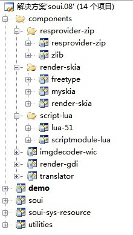
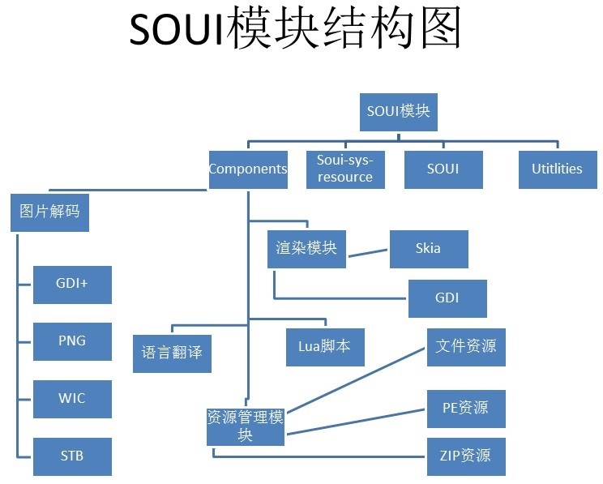
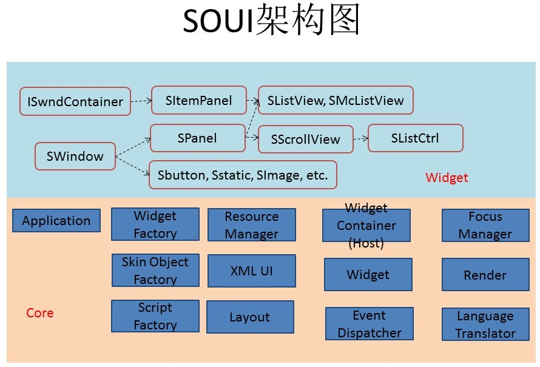

# 概述
## SOUI 是什么？ 

SOUI 是什么？SOUI 是启程软件开发的一个 C++ Direct UI 库。DirectUI 技术一般是指将所有的界面控件都绘制在一个窗口上，这些控件的逻辑和绘图方式都必须自己进行编写和封装，而不是使用 Windows 控件，所以这些控件都是无句柄的。虽然 Direct UI 不是什么新技术，但是要把 UI 做好，Direct UI 确实是目前为止最有效的解决方案。 
DirectUI 技术需要解决的主要问题如下： 

- 窗口的子类化，截获窗口的消息。 
- 封装自己的控件，并将自己的控件绘制到该窗口上。 
- 封装窗口的消息，并分发到自己的控件上，让自己的控件根据消息进行响应和绘制。 
- 根据不同的行为发送自定义消息给窗口，以便程序进行调用。 
- 一般窗口上控件的组织使用 XML 来描述。 

通常 DirectUI 的界面库都采用 XML 配置文件+图片+控制脚本（Lua、Javascript 等）的开发方式，非常类似于 Web 程序的开发方式，当然这里面控制脚本也可以直接使用 C++ 代码来实现。这种开发方式可以大大提高开发效率，将程序员从繁琐的界面工作中解脱出来，并且通过美工的设计，可以使界面更美观。 
SOUI 不是一个新项目，它是基于之前开发的 DuiEngine 界面库，再经过为期近半年的重构后完成的版本，除了 skia 渲染模块还有待进一步完善外，其它模块已经基本达到发布标准。（DuiEngine 是一个基于金山 Bkwin 重构的 UI 库，经过不断更新，已经相对稳定，并且已经在多个有大量用户的客户端产品中使用） 

## SOUI 相对于 DuiEngine 的改进 

做 SOUI 有几个核心需求： 
- 功能模块化：特别是渲染部分要让用户可以根据需要选择适合的模块，如 GDI,GDI+,SKIA; 
- 性能优化,简化 XML 配置； 
- 增加代码注释； 
- 删除原有项目中为了版本兼容而遗留的垃圾代码; 
- 优化项目管理; 
同时新版本也增加了一些新的特性： 
- 新增多语言翻译支持; 
- 程序资源提供模块支持多份，以便为从脚本创建 UI 提供更好的支持，完善 LUA 脚本模块; 

## SOUI 模块结构 
下图为 SOUI 模块截图： 

- soui 模块是整个项目的核心，除 utilities 模块外，其它模块都为 soui 模块服务。 
- utilities 模块提供一些工具类，主要包含 pugixml，及一个 String 类。 
- soui-sys-resource 模块是一个纯资源 DLL，提供一些内置控件必须的资源。 
- demo 模块是 SOUI 界面库的功能演示程序。 
- translator 实现一个从 XML 文件加载多语言翻译资料的类似 QT 的语言翻译模块。 
- render-gdi 和 render-skia 分别实现两个基于 GDI 及 SKIA 的渲染模块，它们可以相互替-换。GDI 的优点是体积小，但是对于 apha 通道支持能力有限；而 skia 的优点是速度快，全面支持 alpha 通道，但是程序体积会有所增加, DLL 编译后有 1M，压缩后有600K。 
- resprovider-zip 实现了一个从 ZIP 文件加载程序资源的模块。加上 soui 中内置的两个
资源加载模块，SOUI 可以选择从文件中，从 EXE 资源中及从 ZIP 文件包中加载程序资源。 
- script-lua 是一个脚本支持模块，目前只实现了几个基本类的导出，要使用更多 SOUI 类型，还需要增加导出代码。 

## 模块结构图及框架图 
模块结构图：
 
SOUI 框架图：
 

 