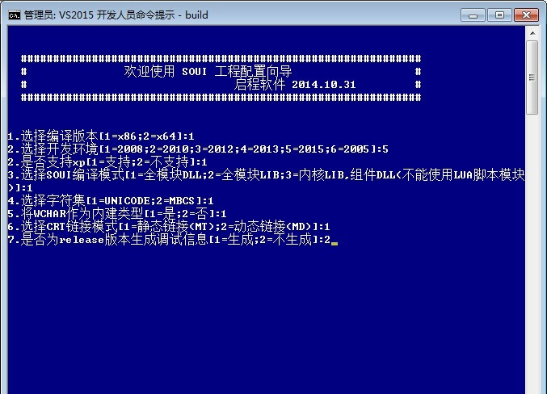

# SOUI的编译

## 获取 SOUI 的源代码 
SOUI 是开源软件，其源码采用 svn 管理（http://code.taobao.org/svn/soui2）；也可以通过 git 客户端获取稳定版本：https://github.com/setoutsoft/soui。

> 注意！此处内容已过时，需要更新

## 编译 SOUI 界面库 
SOUI 项目采用 QT 的 qmake 管理项目文件，qmake 已经从 QT 中分离出来，不需要你的机器上安装 QT。（项目中也包含了网友提供的 cmake 编译脚本） 
 
如果你在使用 vs2015，建议直接使用 build.bat 来编译 SOUI 库。 
首先运行“vs2015 开发人员命令提示”，如果提示无法找到路径之类的提示，请用管理员权限运行，这种情况大部分是在远程桌面编译 SOUI 库时出现。 
使用“cd /d ”命令，把当前路径，切换至 SOUI 项目文件夹，运行 build.bat 批处理。

